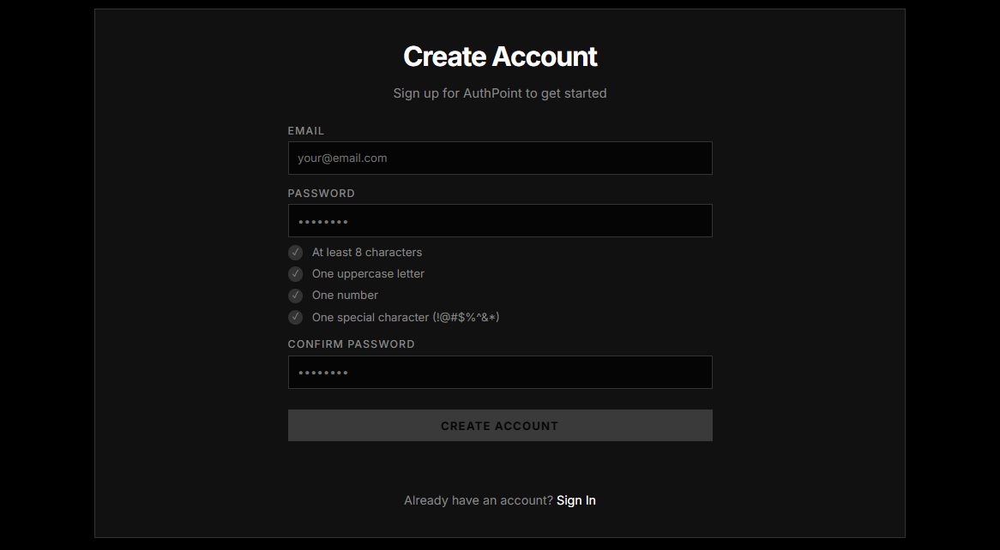
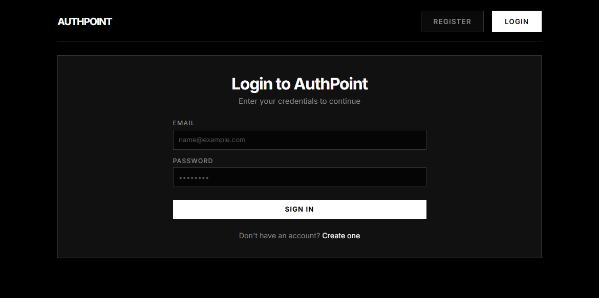
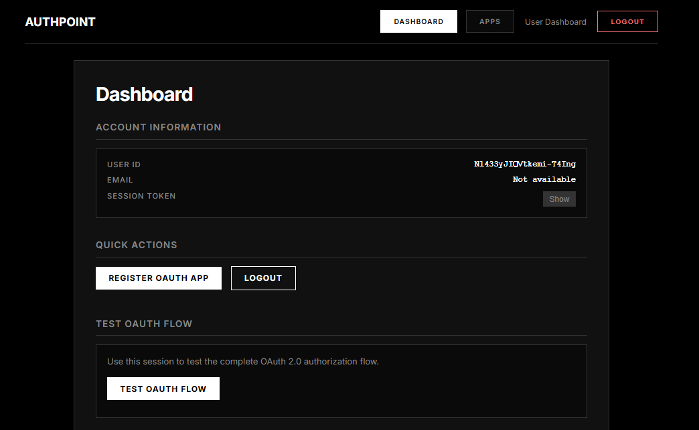
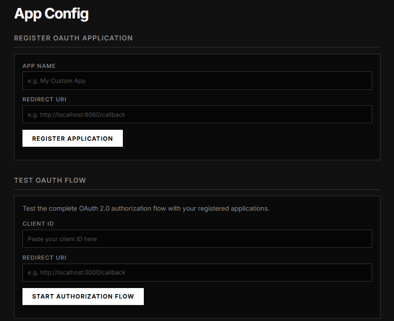
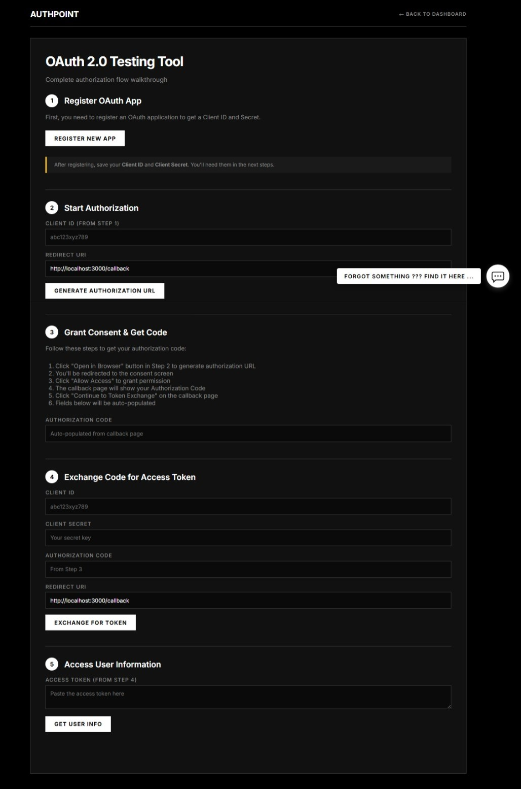

<h1 align="center">AuthPoint</h1>
<h3 align="center">Web-Based Authentication Application</h3>

<p align="center">
AuthPoint is a web-based authentication interface featuring login, registration,
app configuration, and a testing area. It is designed with responsive layout,
clean UI components, and practical authentication workflows.
</p>

<p align="center">
  <a href="#overview">Overview</a> •
  <a href="#features">Features</a> •
  <a href="#tech-stack">Tech Stack</a> •
  <a href="#installation">Installation</a> •
  <a href="#deployment">Deployment</a> •
  <a href="#screenshots">Screenshots</a> •
  <a href="#license">License</a>
</p>

---

<p align="center">
  
  
  
  
</p>

---

## Overview

AuthPoint is a front-end application that simulates authentication services such as user login,
user registration, application configuration, and interaction testing. This project demonstrates
modern UI design principles and is deployable as a static web application.

The app is suitable for showcasing in portfolios, live demos, or as a foundation for full-stack
authentication projects.

---

## Features

- User Registration Interface  
- User Login Interface  
- Dashboard View  
- Application Configuration Panel  
- Testing Area for Authentication Logic  
- Responsive UI layout for multiple screen sizes  
- Clean and consistent interface design  

---

## Tech Stack

### Core Technologies

<p align="left">
  
</p>

### Tools

<p align="left">
  
</p>

---

## Run on Localhost (Dev Server)

### 1. Install dependencies
```bash
npm install
````

### 2. Setup environment file

Rename `.env.example` → `.env`

Then open `.env` and add:

```env
DATABASE_URL="PASTE_YOUR_POSTGRESQL_LINK_HERE"
```

### 3. Start development server

```bash
npm run dev
```

### 4. Open in browser

Go to:

[http://localhost:3000](http://localhost:3000)


---

## Screenshots

<details>
  <summary><strong>Click to expand screenshot gallery</strong></summary>

  <br>

  <p align="center">
    
  </p>
  <p align="center"><i>User registration screen</i></p>

  <p align="center">
    
  </p>
  <p align="center"><i>User login screen</i></p>

  <p align="center">
    
  </p>
  <p align="center"><i>Main dashboard interface</i></p>

  <p align="center">
    
  </p>
  <p align="center"><i>Application configuration panel</i></p>

  <p align="center">
    
  </p>
  <p align="center"><i>Authentication testing area</i></p>

</details>

---

## License

This project is licensed under the MIT License.

---

<p align="center">
  AuthPoint Web Application
</p>
```

---
